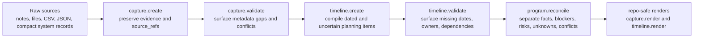

# Truth Tools

`truth-tools` is the unified entrypoint for three truth packages:

- [`capture-truth`](https://github.com/hilmimuktitama/capture-truth) for evidence intake
- [`program-truth`](https://github.com/hilmimuktitama/program-truth) for program reconciliation
- [`timeline-truth`](https://github.com/hilmimuktitama/timeline-truth) for timeline compilation and validation

It keeps the existing packages focused and exposes one consistent CLI and MCP-oriented callable surface for benchmarking and TPM review workflows. Requires Node.js `>=22`.

## Mental Model

`truth-tools` gives AI agents one evidence-first workflow instead of separate setup for capture, timeline, and program status work.



The boundary is deliberate: the tools preserve evidence, conflicts, unknowns, and recommended owner actions. They do not silently decide source-system truth for the user.

## Easy Way: Ask Your AI Agent

If your AI agent supports MCP, ask it to install, verify, and smoke-test `truth-tools` for you.

Give your AI agent this prompt:

```text
Let's use truth-tools from https://github.com/hilmimuktitama/truth-tools.

Please inspect the README, confirm this machine has Node.js >=22, and configure an MCP server named truth-tools.

Prefer the npm package setup:

{
  "mcpServers": {
    "truth-tools": {
      "command": "npx",
      "args": ["-y", "--package=truth-tools", "truth-tools-mcp"]
    }
  }
}

If npm setup is unavailable, use a local checkout fallback: clone the GitHub repo, run npm install, and configure the MCP server with command node and args pointing to C:/path/to/truth-tools/src/mcp-server.js.

Reload or restart the MCP client if needed. Verify setup by calling the MCP tool doctor.all with { "all": true }. If MCP verification is not available yet, run:

npx -y --package=truth-tools truth-tools doctor --all

Then smoke-test the MCP server:
1. Call capture.create with one text source.
2. Call capture.validate with the returned evidence_pack.
3. Call capture.render with export_profile set to repo-safe-summary.
4. Call timeline.create with one planning source.
5. Call timeline.validate with the returned timeline.
6. Call timeline.render with export_profile set to repo-safe-summary.
7. Call program.reconcile with the evidence_pack, timeline, and a short notes array.

Do not infer missing dates, ownership, status, risk, or source-system truth. Preserve conflicts and unknowns, and default repo artifacts to repo-safe-summary.
```

Once your agent confirms the MCP server works, give it source material and ask it to capture evidence, compile a timeline, reconcile program status, and render only repo-safe artifacts.

### Manual MCP Config

Npm package config:

```json
{
  "mcpServers": {
    "truth-tools": {
      "command": "npx",
      "args": ["-y", "--package=truth-tools", "truth-tools-mcp"]
    }
  }
}
```

Local development checkout config:

```json
{
  "mcpServers": {
    "truth-tools": {
      "command": "node",
      "args": ["C:/path/to/truth-tools/src/mcp-server.js"]
    }
  }
}
```

Use the local config only when developing against a checkout instead of the published npm package.

## First Use

Start with source-shaped JSON. Use the output from each create call as input to the matching validate, render, or reconcile call.

### Evidence Capture Input

Call `capture.create` with:

```json
{
  "sources": [
    {
      "id": "status-note",
      "type": "text",
      "path": "notes/status.txt",
      "captured_at": "2026-05-12T14:00:00Z",
      "freshness": "fresh",
      "content": "API contract is blocked by missing owner by 2026-05-20."
    }
  ]
}
```

Then call `capture.validate` with `{ "evidence_pack": <returned evidence pack> }`, followed by `capture.render` with:

```json
{
  "evidence_pack": {
    "kind": "evidence_pack",
    "sources": [
      {
        "id": "status-note",
        "type": "text",
        "captured_at": "2026-05-12T14:00:00Z",
        "freshness": "fresh",
        "content": "API contract is blocked by missing owner by 2026-05-20."
      }
    ],
    "claims": [
      {
        "id": "claim-1",
        "text": "API contract is blocked by missing owner by 2026-05-20.",
        "source_refs": [{ "sourceId": "status-note" }]
      }
    ],
    "gaps": [],
    "conflicts": [],
    "assumptions": []
  },
  "export_profile": "repo-safe-summary"
}
```

### Timeline Planning Input

Call `timeline.create` with:

```json
{
  "sources": [
    {
      "id": "planning-note",
      "type": "text",
      "captured_at": "2026-05-12T14:05:00Z",
      "freshness": "fresh",
      "content": "Discovery: 2026-06-01 to 2026-06-05 owner PM status planned\nAPI contract: owner Platform depends on Discovery\nLaunch decision milestone on 2026-06-17 owner PM"
    }
  ]
}
```

Then call `timeline.validate` with `{ "timeline": <returned timeline> }`, followed by `timeline.render` with:

```json
{
  "timeline": {
    "items": [
      {
        "title": "Discovery",
        "type": "task",
        "start": "2026-06-01",
        "end": "2026-06-05",
        "owner": "PM",
        "status": "planned",
        "dependencies": [],
        "source_refs": [{ "sourceId": "planning-note", "line": 1 }]
      },
      {
        "title": "API contract",
        "type": "task",
        "date_text": "TBC",
        "date_status": "tbc",
        "owner": "Platform",
        "status": "planned",
        "dependencies": ["Discovery"],
        "source_refs": [{ "sourceId": "planning-note", "line": 2 }]
      }
    ],
    "assumptions": ["No dates were inferred."],
    "gaps": [
      {
        "itemTitle": "API contract",
        "field": "date",
        "question": "Confirm start and end dates before publishing.",
        "source_refs": [{ "sourceId": "planning-note", "line": 2 }]
      }
    ]
  },
  "export_profile": "repo-safe-summary"
}
```

### Program Reconciliation Input

Call `program.reconcile` with:

```json
{
  "evidence_pack": {
    "kind": "evidence_pack",
    "sources": [
      {
        "id": "status-note",
        "type": "text",
        "captured_at": "2026-05-12T14:00:00Z",
        "freshness": "fresh",
        "content": "API contract is blocked by missing owner by 2026-05-20."
      }
    ],
    "claims": [
      {
        "id": "claim-1",
        "text": "API contract is blocked by missing owner by 2026-05-20.",
        "source_refs": [{ "sourceId": "status-note" }]
      }
    ],
    "conflicts": [
      {
        "claim": "Launch decision date",
        "source_a": { "system": "planning-note", "value": "2026-06-17" },
        "source_b": { "system": "jira", "value": "2026-06-20" },
        "conflict_type": "date_mismatch"
      }
    ],
    "assumptions": ["No source was treated as automatically authoritative."]
  },
  "timeline": {
    "items": [
      {
        "title": "API contract",
        "date_text": "TBC",
        "date_status": "tbc",
        "owner": "Platform",
        "source_refs": [{ "sourceId": "planning-note", "line": 2 }]
      }
    ],
    "gaps": [
      {
        "itemTitle": "API contract",
        "field": "date",
        "question": "Confirm start and end dates before publishing.",
        "source_refs": [{ "sourceId": "planning-note", "line": 2 }]
      }
    ],
    "assumptions": ["No dates were inferred."]
  },
  "notes": [
    "Treat this as a draft until owners reconcile source-system date conflicts."
  ]
}
```

The returned program status separates confirmed facts, blockers, risks, unknowns, conflicts, assumptions, and write-back recommendations.

## Agent Operating Rules

- Validate before rendering: `capture.validate` after `capture.create`, and `timeline.validate` after `timeline.create`.
- Default repo artifacts to `repo-safe-summary`.
- Preserve conflicts and unknowns instead of resolving them silently.
- Do not infer missing dates, ownership, status, risk, or source-system truth.
- Never commit `raw-local-only` output.
- Keep raw Jira, Confluence, customer, credential, or private operational data outside committed repo paths.

## MCP Tools

The MCP server exposes these dotted tool names:

| Tool | Required top-level args | Purpose | Recommended next call |
| --- | --- | --- | --- |
| `doctor.all` | none (`all` is optional) | Smoke-test install, schemas, render path, and MCP tool surface. | Start first-use flow. |
| `capture.create` | `sources` | Create an evidence pack from pasted, local, or adapter-produced sources. | `capture.validate` |
| `capture.validate` | `evidence_pack` | Validate source metadata, freshness, references, and conflicts. | `capture.render` |
| `capture.render` | `evidence_pack` | Render evidence using a repo-safe, internal, or raw-local export profile. | `program.reconcile` |
| `timeline.create` | `sources` | Create a normalized evidence-preserving timeline from planning sources. | `timeline.validate` |
| `timeline.validate` | `timeline` | Validate unknowns, missing fields, and dependency issues. | `timeline.render` |
| `timeline.render` | `timeline` | Render a timeline as Mermaid, Markdown, or export-profile-safe summary. | `program.reconcile` |
| `program.reconcile` | none; usually `evidence_pack`, `timeline`, and `notes` | Reconcile captured evidence and timelines into a standard program-status object. | Render repo-safe artifacts for review. |

## CLI Usage

```bash
truth-tools doctor --all

truth-tools capture create --input intake.json
truth-tools capture validate --input evidence-pack.json
truth-tools capture render --export-profile repo-safe-summary --input evidence-pack.json

truth-tools program reconcile --input program-input.json

truth-tools timeline create --input intake.json
truth-tools timeline validate --input timeline.json
truth-tools timeline render --format markdown --input timeline.json
truth-tools timeline render --export-profile repo-safe-summary --input timeline.json
```

## Doctor

`truth-tools doctor --all` checks:

- local install and runtime truth package availability
- shared conflict, timeline unknown, and program-status schemas
- repo-safe render path
- MCP tool-surface availability

Use `truth-tools doctor --all --no-update-check` for CI or offline runs.

## Conflict Schema

Conflicts are normalized as:

```json
{
  "claim": "Real-client rollout start date",
  "source_a": { "system": "local-note", "value": "2026-05-27" },
  "source_b": { "system": "jira", "value": "2026-06-02" },
  "conflict_type": "date_mismatch",
  "recommended_owner_action": "Assign an owner to reconcile the source disagreement and update the system of record."
}
```

## Timeline Unknowns

Timeline items carry explicit uncertainty:

```json
{
  "title": "Phase 2 rollout",
  "date_status": "tbc",
  "blocks_next_milestone": "unknown"
}
```

Supported `date_status` values:

- `exact`
- `range`
- `earliest`
- `tbc`
- `conflicting`

Supported `blocks_next_milestone` values:

- `true`
- `false`
- `unknown`

## Program Status Schema

`program.reconcile` returns:

- `confirmed_facts`
- `blockers`
- `risks`
- `unknowns`
- `conflicts`
- `assumptions`
- `recommended_write_back`

`recommended_write_back` separates what belongs in the repo, what belongs in `.tmp/`, and what needs source-system updates.

## Export Profiles

`repo-safe-summary` is the default safety posture for TPM repos. It omits raw source bodies and favors compact facts, gaps, conflicts, and owner actions.

`internal-evidence-pack` keeps structured evidence metadata but redacts raw `content` fields before rendering.

`raw-local-only` returns the full artifact and should stay local. Do not commit raw Jira, Confluence, customer, credential, or private operational data.

All render paths run a redaction check for common credential and sensitive-data markers.

## Update Checks

`truth-tools doctor --all` checks npm for newer versions of `truth-tools`, `capture-truth`, and `timeline-truth`.

Use `truth-tools doctor --all --no-update-check` for CI or offline runs.

## Development

```bash
npm test
npm run check
npm pack --dry-run
```
